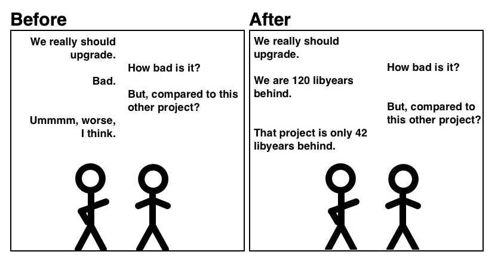

## Day 11: Gather a dependency freshness metric.

### Assessing dependencies.

You may need to calculate this kind of metrics to ensure 
you are not too much in debt regarding your dependencies.

The concept of [`libyear`](https://libyear.com/) can help us to do so.

- Let's add [`libyear-maven-plugin`](https://github.com/mfoo/libyear-maven-plugin) to our `pom.xml`

- Then we run the plugin
  - It calculates the `libyears` for each dependencies
  - Meaning we have 9 libyears here...

> We should definitely do something about it...

- This kind of tool can really help teams take decisions regarding dependencies debt. Metrics reassure people.

- A very interesting stuff with this plugin is its configuration

- We can make a build failing based on a given `threshold`

- This kind of tool helps us, as a team, to take care of our dependencies
  - Forcing us to update them very regularly
  - It makes dependencies management much, much easier

If you want to know more on "how to keep you dependencies up-to-date", 
you read this [article](https://xtrem-tdd.netlify.app/Flavours/keep-dependencies-up-to-date).

>**Tip of the day: Code maintenance is not always about refactoring.**

### Share your experience

How does your code look like? Anything you'd like to add?

Please let everyone know in the discord.
